# Welcome to the SuperDataScience Community Project!

Welcome to the **FinResearch AI: Automated Financial Market Intelligence with Multi-Agent Systems** repository! 🎉

This project is a collaborative initiative brought to you by **SuperDataScience**, a global learning community focused on data science, machine learning, and AI. Whether you're starting with Agentic AI or ready to build a full **multi-agent financial research system**, we're excited to have you on board!

This project follows the standard SDS structure and learning philosophy found in previous projects such as **ScholarAI** , **MLPayGrade** , and **SpineScope**  — but extends them into the world of **financial data analysis**, **market intelligence**, and **AI-driven research workflows**.

To contribute to this project, please follow the guidelines in our **CONTRIBUTING.md** file.

---

# 📘 Project Overview

**FinResearch AI** is an AI-driven financial research system that automates market intelligence using **agentic AI workflows**, **web & news scraping**, **quantitative analysis**, and **automated report generation**.

The system integrates multiple agents — each with a specialized role — and a shared memory (vector DB) to collaboratively produce investment-style summaries, financial analyses, and data-backed insights.

You will build one of two possible implementations:

* 🟢 **Beginner Track — Single-Agent Market Research Assistant**
* 🔴 **Advanced Track — Multi-Agent Financial Research System (CrewAI-Style)**

---

## 🔍 What FinResearch AI Does

### Core Capabilities

FinResearch AI will:

1. **Search** the web, financial news, and APIs for the latest market information
2. **Analyze** market data, ratios, and fundamentals
3. **Synthesize** insights into a clean, structured report
4. **Format** outputs into professional-grade summaries (analyst-style)
5. **Deliver** results through a web UI (Gradio or Streamlit)

### Key Technologies

* **LLM Framework:** OpenAI Agents SDK / CrewAI (Advanced)
* **Financial APIs:** Yahoo Finance, Alpha Vantage, FinancialModelingPrep
* **Search APIs:** Tavily or SerpAPI
* **Vector DB:** ChromaDB / FAISS
* **UI:** Gradio or Streamlit
* **Deployment:** Hugging Face Spaces or Streamlit Cloud

---

# 📂 Repository Structure
```
FinResearch-AI/
├── CONTRIBUTING.md
├── README.md     ← You are here!
├── requirements.txt
├── doc/
│   └── product_requirement_document.md
├── internal_memory_db/
│   ├── chroma.sqlite3
│   └── be714d62-d67d-471f-9d64-28552256a2d0/
├── src/
│   ├── main.py
│   ├── agents/
│   │   ├── __init__.py
│   │   ├── base.py
│   │   ├── financial_analyst.py
│   │   ├── financial_crew.py
│   │   ├── manager.py
│   │   ├── market_researcher.py
│   │   ├── reporter.py
│   │   └── prompts/
│   │       ├── financial_analyst.md
│   │       ├── market_researcher.md
│   │       └── reporter.md
│   ├── config/
│   │   ├── __init__.py
│   │   └── settings.py
│   ├── tools/
│   │   ├── __init__.py
│   │   ├── financial_tools.py
│   │   ├── memory_store.py
│   │   ├── memory_tools.py
│   │   └── internal_memory_db/
│   │       └── chroma.sqlite3
│   └── ui/
│       ├── __init__.py
│       ├── app.py
│       ├── run_ui.py
│       ├── components/
│       │   ├── __init__.py
│       │   ├── export.py
│       │   ├── input.py
│       │   └── output.py
│       └── utils/
│           ├── formatters.py
│           └── state_manager.py
```  

# Usage on local
streamlit run .\src\ui\app.py

# 🟢 Beginner Track — Single-Agent Market Research

Perfect for members **new to agentic AI**.

You will build a simple **one-agent pipeline** capable of:

* Fetching financial data using an API
* Searching market summaries and news
* Generating a structured financial report
* Presenting results in a small UI

### Beginner Workflow


You will learn:

* API integration (finance + search)
* LLM tool use
* Structured outputs with Pydantic schema
* Building/Deploying a UI

A full scope of work will be provided in **beginner/README.md**.

---

# 🔴 Advanced Track — Multi-Agent Financial Research System

This track mirrors and extends the **multi-agent orchestration concepts** from ScholarAI Advanced  but redesigned specifically for **financial market intelligence**.

### Agents in the System

#### **1. Manager Agent (Orchestrator + Quality Control)**

* Receives user request
* Delegates work to other agents
* Ensures all findings are complete and consistent
* Produces the final polished report

#### **2. Researcher Agent — Web & News Scraper**

* Searches markets, news, press releases, and analyst commentary
* Extracts relevant text snippets
* Stores results in vector memory

#### **3. Financial Analyst Agent — Quant & Ratios**

* Pulls APIs for price history
* Computes:

  * P/E, PEG, ROE, ROA
  * Revenue/EPS growth
  * Volatility & risk measures
* Writes structured insights

#### **4. Reporting Agent — Synthesis & Formatting**

* Fetches all context from shared memory
* Generates a professional-style financial report
* Applies formatting, sections, and bullet summaries

#### **5. Shared Memory — Vector DB / Embeddings**

* Stores intermediate research
* Allows all agents to access each other's findings
* Enables iterative refinement

---

## Advanced Architecture Diagram (Based on Your Image)

## Advanced Architecture Diagram

```mermaid
flowchart TD
    User([👤 User Input]) --> Manager([🎯 Manager Agent])
    Manager --> Researcher([🔍 Researcher Agent])
    Manager --> Analyst([📊 Financial Analyst Agent])
    Manager --> Reporter([📝 Reporting Agent])
    
    Researcher --> SearchAPI([🌐 Search APIs])
    Analyst --> DataAPI([📈 Market Data APIs])
    Reporter --> Report([📤 Final Report])
    
    Memory[(💾 Shared Vector Memory)] -.-> Manager
    Memory -.-> Researcher
    Memory -.-> Analyst
    Memory -.-> Reporter
    
    style User fill:#5e81ac,stroke:#2e3440,stroke-width:2px,color:#eceff4
    style Manager fill:#88c0d0,stroke:#2e3440,stroke-width:3px,color:#2e3440
    style Researcher fill:#d08770,stroke:#2e3440,stroke-width:2px,color:#2e3440
    style Analyst fill:#d08770,stroke:#2e3440,stroke-width:2px,color:#2e3440
    style Reporter fill:#d08770,stroke:#2e3440,stroke-width:2px,color:#2e3440
    style SearchAPI fill:#5e81ac,stroke:#2e3440,stroke-width:2px,color:#eceff4
    style DataAPI fill:#5e81ac,stroke:#2e3440,stroke-width:2px,color:#eceff4
    style Report fill:#a3be8c,stroke:#2e3440,stroke-width:2px,color:#2e3440
    style Memory fill:#b48ead,stroke:#2e3440,stroke-width:2px,color:#eceff4
```



This is built to mimic real-world financial research workflows.

A detailed scope will be created inside **advanced/README.md** next.

---

# 🛠️ APIs & Tools Required

### Sign Up For:

* **OpenAI API key**
* **Search**: Tavily or SerpAPI
* **Financial/Market Data**:

  * Yahoo Finance (yfinance)
  * [Financial Datasets API](https://docs.financialdatasets.ai/introduction)

### Tools

* Python 3.10+
* OpenAI Agent SDK / CrewAI
* ChromaDB / FAISS
* Gradio or Streamlit

---

# 📅 Project Timeline

| Phase                             | Beginner Track                 | Advanced Track                               |
| --------------------------------- | ------------------------------ | -------------------------------------------- |
| **Week 1: Setup + Foundations**   | Repo setup, APIs, single agent | Multi-agent architecture, embeddings, memory |
| **Week 2: Research + Analysis**   | Fetch news + market data       | Researcher + Analyst agents implemented      |
| **Week 3: Synthesis + Reporting** | Basic report generation        | Reporting Agent + Manager orchestration      |
| **Week 4: UI + Deployment**       | Gradio/Streamlit app           | Full multi-agent pipeline deployment         |

Timeline follows the structure used in prior SDS Scopes
 

---

# 🙌 Contributions & Community

Both **team members** and **community contributors** are welcome.

Submit work to the correct folder:

* `/beginner/submissions/team-members/`
* `/advanced/submissions/community-contributions/`

Full instructions in **CONTRIBUTING.md**.

---

# 🎓 Ready to Begin?

1. Choose your track
2. Read the appropriate **README** (“Scope of Works”)
3. Set up your environment
4. Start building your agentic AI system
5. Submit your project report

If you have questions, open an issue or reach out to the SDS community.

🚀 **Let’s build the future of financial AI together!**
